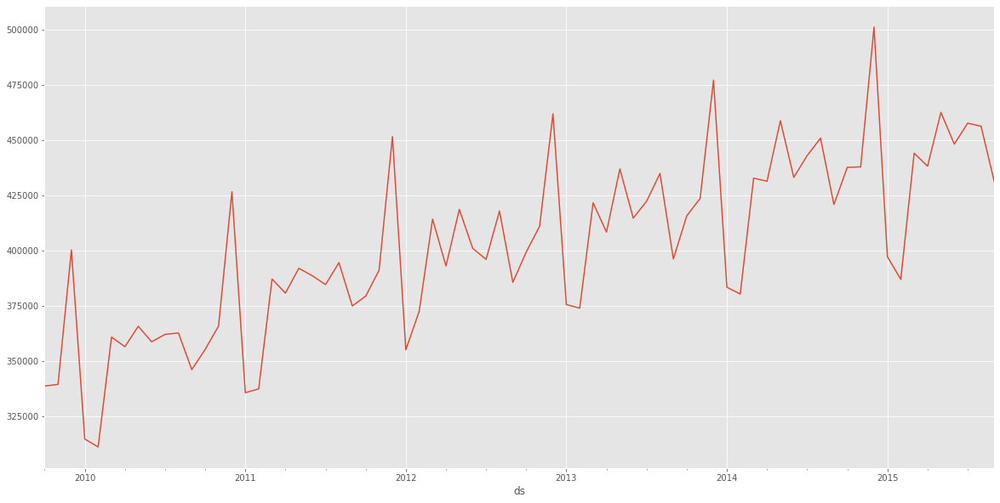
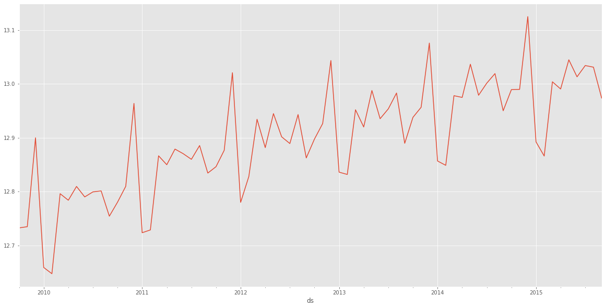
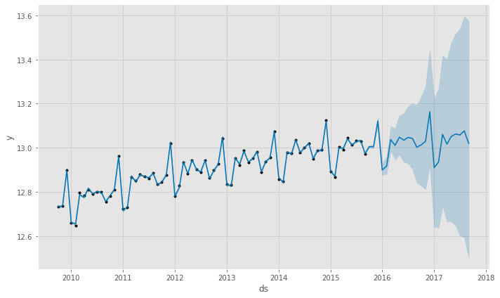
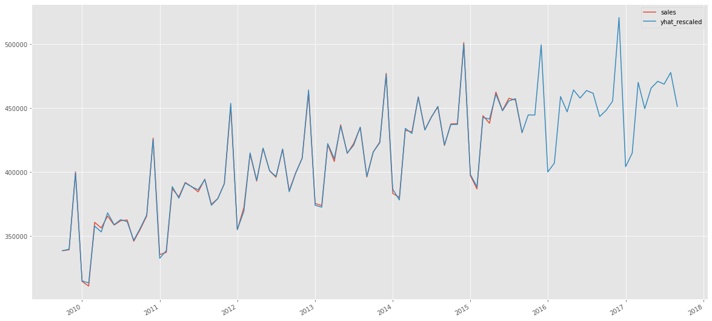
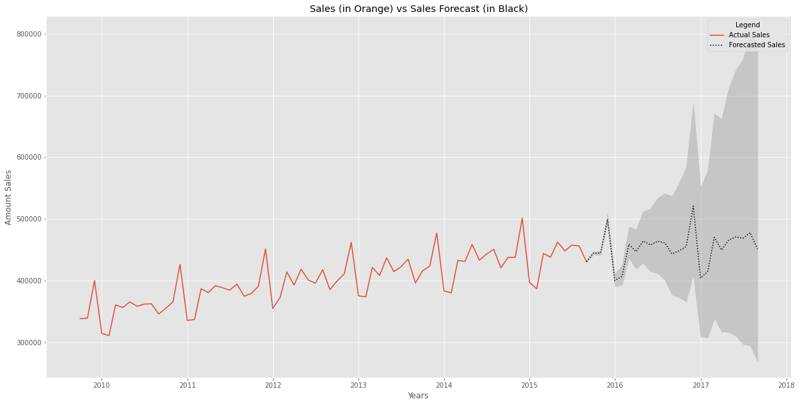

# Forecasting Time Series Data with Prophet

#### Import modules


```python
import pandas as pd
import numpy as np
from prophet import Prophet
import matplotlib.pyplot as plt
 
plt.rcParams['figure.figsize']=(20,10)
plt.style.use('ggplot')
```


```python
# Resolving conflict (Matplotlib must be registered with Pandas due to a conflict between Prophet and Pandas.)
pd.plotting.register_matplotlib_converters() 
```

#### Read the data in from the retail_sales.csv file and set the index to the date column.


```python
sales_df = pd.read_csv("retail_sales.csv", index_col='date', parse_dates=True)
```

#### Pandas dataframe with data looks  like this:


```python
sales_df.head()
```


<div>
<style scoped>
    .dataframe tbody tr th:only-of-type {
        vertical-align: middle;
    }

    .dataframe tbody tr th {
        vertical-align: top;
    }

    .dataframe thead th {
        text-align: right;
    }
</style>
<table border="1" class="dataframe">
  <thead>
    <tr style="text-align: right;">
      <th></th>
      <th>sales</th>
    </tr>
    <tr>
      <th>date</th>
      <th></th>
    </tr>
  </thead>
  <tbody>
    <tr>
      <th>2009-10-01</th>
      <td>338630</td>
    </tr>
    <tr>
      <th>2009-11-01</th>
      <td>339386</td>
    </tr>
    <tr>
      <th>2009-12-01</th>
      <td>400264</td>
    </tr>
    <tr>
      <th>2010-01-01</th>
      <td>314640</td>
    </tr>
    <tr>
      <th>2010-02-01</th>
      <td>311022</td>
    </tr>
  </tbody>
</table>
</div>


```python

```


```python

```

### Start working with prophet

####  create new data frame with different indexes


```python
df = sales_df.reset_index()
```


```python
df.head()
```


<div>
<style scoped>
    .dataframe tbody tr th:only-of-type {
        vertical-align: middle;
    }

    .dataframe tbody tr th {
        vertical-align: top;
    }

    .dataframe thead th {
        text-align: right;
    }
</style>
<table border="1" class="dataframe">
  <thead>
    <tr style="text-align: right;">
      <th></th>
      <th>date</th>
      <th>sales</th>
    </tr>
  </thead>
  <tbody>
    <tr>
      <th>0</th>
      <td>2009-10-01</td>
      <td>338630</td>
    </tr>
    <tr>
      <th>1</th>
      <td>2009-11-01</td>
      <td>339386</td>
    </tr>
    <tr>
      <th>2</th>
      <td>2009-12-01</td>
      <td>400264</td>
    </tr>
    <tr>
      <th>3</th>
      <td>2010-01-01</td>
      <td>314640</td>
    </tr>
    <tr>
      <th>4</th>
      <td>2010-02-01</td>
      <td>311022</td>
    </tr>
  </tbody>
</table>
</div>


#### Rename columns as required by prophet


```python
df=df.rename(columns={'date':'ds', 'sales':'y'})
```


```python
df.head()
```


<div>
<style scoped>
    .dataframe tbody tr th:only-of-type {
        vertical-align: middle;
    }

    .dataframe tbody tr th {
        vertical-align: top;
    }

    .dataframe thead th {
        text-align: right;
    }
</style>
<table border="1" class="dataframe">
  <thead>
    <tr style="text-align: right;">
      <th></th>
      <th>ds</th>
      <th>y</th>
    </tr>
  </thead>
  <tbody>
    <tr>
      <th>0</th>
      <td>2009-10-01</td>
      <td>338630</td>
    </tr>
    <tr>
      <th>1</th>
      <td>2009-11-01</td>
      <td>339386</td>
    </tr>
    <tr>
      <th>2</th>
      <td>2009-12-01</td>
      <td>400264</td>
    </tr>
    <tr>
      <th>3</th>
      <td>2010-01-01</td>
      <td>314640</td>
    </tr>
    <tr>
      <th>4</th>
      <td>2010-02-01</td>
      <td>311022</td>
    </tr>
  </tbody>
</table>
</div>


#### Plot the data using Pandas' plot function


```python
df.set_index('ds').y.plot().get_figure()
```


    

    
    


```python
#### Numpy's log() to log-transform of our data
```


```python
df['y'] = np.log(df['y'])
```


```python
df.tail()
```


<div>
<style scoped>
    .dataframe tbody tr th:only-of-type {
        vertical-align: middle;
    }

    .dataframe tbody tr th {
        vertical-align: top;
    }

    .dataframe thead th {
        text-align: right;
    }
</style>
<table border="1" class="dataframe">
  <thead>
    <tr style="text-align: right;">
      <th></th>
      <th>ds</th>
      <th>y</th>
    </tr>
  </thead>
  <tbody>
    <tr>
      <th>67</th>
      <td>2015-05-01</td>
      <td>13.044650</td>
    </tr>
    <tr>
      <th>68</th>
      <td>2015-06-01</td>
      <td>13.013060</td>
    </tr>
    <tr>
      <th>69</th>
      <td>2015-07-01</td>
      <td>13.033991</td>
    </tr>
    <tr>
      <th>70</th>
      <td>2015-08-01</td>
      <td>13.030993</td>
    </tr>
    <tr>
      <th>71</th>
      <td>2015-09-01</td>
      <td>12.973671</td>
    </tr>
  </tbody>
</table>
</div>


```python
df.set_index('ds').y.plot().get_figure()
```


    

    
    


```python
### Running prophet in our data
```


```python
model = Prophet(weekly_seasonality=True, daily_seasonality=True)
model.fit(df);
```

    INFO:cmdstanpy:start chain 1
    INFO:cmdstanpy:finish chain 1


#### Forecasting is useless unless you can look into the future, so we need to add some future dates to our dataframe. 
#### I tried to forecast 2 years into the future, so I'll built a future dataframe with 24 periods since we are working with monthly data.


```python
future = model.make_future_dataframe(periods=24, freq = 'm')
future.tail()
```


<div>
<style scoped>
    .dataframe tbody tr th:only-of-type {
        vertical-align: middle;
    }

    .dataframe tbody tr th {
        vertical-align: top;
    }

    .dataframe thead th {
        text-align: right;
    }
</style>
<table border="1" class="dataframe">
  <thead>
    <tr style="text-align: right;">
      <th></th>
      <th>ds</th>
    </tr>
  </thead>
  <tbody>
    <tr>
      <th>91</th>
      <td>2017-04-30</td>
    </tr>
    <tr>
      <th>92</th>
      <td>2017-05-31</td>
    </tr>
    <tr>
      <th>93</th>
      <td>2017-06-30</td>
    </tr>
    <tr>
      <th>94</th>
      <td>2017-07-31</td>
    </tr>
    <tr>
      <th>95</th>
      <td>2017-08-31</td>
    </tr>
  </tbody>
</table>
</div>


```python
forecast = model.predict(future)
```


```python
forecast.tail()
```


<div>
<style scoped>
    .dataframe tbody tr th:only-of-type {
        vertical-align: middle;
    }

    .dataframe tbody tr th {
        vertical-align: top;
    }

    .dataframe thead th {
        text-align: right;
    }
</style>
<table border="1" class="dataframe">
  <thead>
    <tr style="text-align: right;">
      <th></th>
      <th>ds</th>
      <th>trend</th>
      <th>yhat_lower</th>
      <th>yhat_upper</th>
      <th>trend_lower</th>
      <th>trend_upper</th>
      <th>additive_terms</th>
      <th>additive_terms_lower</th>
      <th>additive_terms_upper</th>
      <th>daily</th>
      <th>...</th>
      <th>weekly</th>
      <th>weekly_lower</th>
      <th>weekly_upper</th>
      <th>yearly</th>
      <th>yearly_lower</th>
      <th>yearly_upper</th>
      <th>multiplicative_terms</th>
      <th>multiplicative_terms_lower</th>
      <th>multiplicative_terms_upper</th>
      <th>yhat</th>
    </tr>
  </thead>
  <tbody>
    <tr>
      <th>91</th>
      <td>2017-04-30</td>
      <td>1.049453</td>
      <td>12.666169</td>
      <td>13.475116</td>
      <td>0.666639</td>
      <td>1.473334</td>
      <td>12.001841</td>
      <td>12.001841</td>
      <td>12.001841</td>
      <td>11.987007</td>
      <td>...</td>
      <td>-0.016038</td>
      <td>-0.016038</td>
      <td>-0.016038</td>
      <td>0.030872</td>
      <td>0.030872</td>
      <td>0.030872</td>
      <td>0.0</td>
      <td>0.0</td>
      <td>0.0</td>
      <td>13.051294</td>
    </tr>
    <tr>
      <th>92</th>
      <td>2017-05-31</td>
      <td>1.050992</td>
      <td>12.646565</td>
      <td>13.516527</td>
      <td>0.636652</td>
      <td>1.504067</td>
      <td>12.011569</td>
      <td>12.011569</td>
      <td>12.011569</td>
      <td>11.987007</td>
      <td>...</td>
      <td>0.011240</td>
      <td>0.011240</td>
      <td>0.011240</td>
      <td>0.013322</td>
      <td>0.013322</td>
      <td>0.013322</td>
      <td>0.0</td>
      <td>0.0</td>
      <td>0.0</td>
      <td>13.062561</td>
    </tr>
    <tr>
      <th>93</th>
      <td>2017-06-30</td>
      <td>1.052482</td>
      <td>12.603017</td>
      <td>13.539531</td>
      <td>0.604683</td>
      <td>1.537030</td>
      <td>12.005339</td>
      <td>12.005339</td>
      <td>12.005339</td>
      <td>11.987007</td>
      <td>...</td>
      <td>0.000166</td>
      <td>0.000166</td>
      <td>0.000166</td>
      <td>0.018166</td>
      <td>0.018166</td>
      <td>0.018166</td>
      <td>0.0</td>
      <td>0.0</td>
      <td>0.0</td>
      <td>13.057821</td>
    </tr>
    <tr>
      <th>94</th>
      <td>2017-07-31</td>
      <td>1.054021</td>
      <td>12.593752</td>
      <td>13.594964</td>
      <td>0.571201</td>
      <td>1.569261</td>
      <td>12.023015</td>
      <td>12.023015</td>
      <td>12.023015</td>
      <td>11.987007</td>
      <td>...</td>
      <td>-0.000827</td>
      <td>-0.000827</td>
      <td>-0.000827</td>
      <td>0.036835</td>
      <td>0.036835</td>
      <td>0.036835</td>
      <td>0.0</td>
      <td>0.0</td>
      <td>0.0</td>
      <td>13.077036</td>
    </tr>
    <tr>
      <th>95</th>
      <td>2017-08-31</td>
      <td>1.055561</td>
      <td>12.504886</td>
      <td>13.575550</td>
      <td>0.539106</td>
      <td>1.611749</td>
      <td>11.964519</td>
      <td>11.964519</td>
      <td>11.964519</td>
      <td>11.987007</td>
      <td>...</td>
      <td>0.009229</td>
      <td>0.009229</td>
      <td>0.009229</td>
      <td>-0.031717</td>
      <td>-0.031717</td>
      <td>-0.031717</td>
      <td>0.0</td>
      <td>0.0</td>
      <td>0.0</td>
      <td>13.020080</td>
    </tr>
  </tbody>
</table>
<p>5 rows × 22 columns</p>
</div>


#### We really only want to look at yhat, yhat_lower, and yhat_upper


```python
forecast[['ds', 'yhat', 'yhat_lower', 'yhat_upper']].tail()
```


<div>
<style scoped>
    .dataframe tbody tr th:only-of-type {
        vertical-align: middle;
    }

    .dataframe tbody tr th {
        vertical-align: top;
    }

    .dataframe thead th {
        text-align: right;
    }
</style>
<table border="1" class="dataframe">
  <thead>
    <tr style="text-align: right;">
      <th></th>
      <th>ds</th>
      <th>yhat</th>
      <th>yhat_lower</th>
      <th>yhat_upper</th>
    </tr>
  </thead>
  <tbody>
    <tr>
      <th>91</th>
      <td>2017-04-30</td>
      <td>13.051294</td>
      <td>12.666169</td>
      <td>13.475116</td>
    </tr>
    <tr>
      <th>92</th>
      <td>2017-05-31</td>
      <td>13.062561</td>
      <td>12.646565</td>
      <td>13.516527</td>
    </tr>
    <tr>
      <th>93</th>
      <td>2017-06-30</td>
      <td>13.057821</td>
      <td>12.603017</td>
      <td>13.539531</td>
    </tr>
    <tr>
      <th>94</th>
      <td>2017-07-31</td>
      <td>13.077036</td>
      <td>12.593752</td>
      <td>13.594964</td>
    </tr>
    <tr>
      <th>95</th>
      <td>2017-08-31</td>
      <td>13.020080</td>
      <td>12.504886</td>
      <td>13.575550</td>
    </tr>
  </tbody>
</table>
</div>


#### Prophet has a plotting mechanism. This plot functionality draws the original data (black dots), the model (blue line), and the error of the forecast (shaded blue area).


```python
model.plot(forecast);
```


    

    


```python

```


```python

```


```python

```

### Visualizing Prophet Model

#### Replace the indexes with original one


```python
df.set_index('ds', inplace=True)
forecast.set_index('ds', inplace=True)
```

#### combine the original data and our forecast model data


```python
viz_df = sales_df.join(forecast[['yhat', 'yhat_lower','yhat_upper']], how = 'outer')
```


```python
viz_df.head()
```


<div>
<style scoped>
    .dataframe tbody tr th:only-of-type {
        vertical-align: middle;
    }

    .dataframe tbody tr th {
        vertical-align: top;
    }

    .dataframe thead th {
        text-align: right;
    }
</style>
<table border="1" class="dataframe">
  <thead>
    <tr style="text-align: right;">
      <th></th>
      <th>sales</th>
      <th>yhat</th>
      <th>yhat_lower</th>
      <th>yhat_upper</th>
    </tr>
  </thead>
  <tbody>
    <tr>
      <th>2009-10-01</th>
      <td>338630.0</td>
      <td>12.732678</td>
      <td>12.728205</td>
      <td>12.737174</td>
    </tr>
    <tr>
      <th>2009-11-01</th>
      <td>339386.0</td>
      <td>12.736238</td>
      <td>12.731643</td>
      <td>12.740895</td>
    </tr>
    <tr>
      <th>2009-12-01</th>
      <td>400264.0</td>
      <td>12.897750</td>
      <td>12.893196</td>
      <td>12.902534</td>
    </tr>
    <tr>
      <th>2010-01-01</th>
      <td>314640.0</td>
      <td>12.660705</td>
      <td>12.656223</td>
      <td>12.665336</td>
    </tr>
    <tr>
      <th>2010-02-01</th>
      <td>311022.0</td>
      <td>12.655329</td>
      <td>12.650727</td>
      <td>12.659760</td>
    </tr>
  </tbody>
</table>
</div>


#### the data has been joined correctly but the scales of our original data (sales) and our model (yhat) are different. So let's rescale the yhat column to get the same scale using numpy exp()


```python
viz_df['yhat_rescaled'] = np.exp(viz_df['yhat'])
```


```python
viz_df.head()
```


<div>
<style scoped>
    .dataframe tbody tr th:only-of-type {
        vertical-align: middle;
    }

    .dataframe tbody tr th {
        vertical-align: top;
    }

    .dataframe thead th {
        text-align: right;
    }
</style>
<table border="1" class="dataframe">
  <thead>
    <tr style="text-align: right;">
      <th></th>
      <th>sales</th>
      <th>yhat</th>
      <th>yhat_lower</th>
      <th>yhat_upper</th>
      <th>yhat_rescaled</th>
    </tr>
  </thead>
  <tbody>
    <tr>
      <th>2009-10-01</th>
      <td>338630.0</td>
      <td>12.732678</td>
      <td>12.728205</td>
      <td>12.737174</td>
      <td>338634.800190</td>
    </tr>
    <tr>
      <th>2009-11-01</th>
      <td>339386.0</td>
      <td>12.736238</td>
      <td>12.731643</td>
      <td>12.740895</td>
      <td>339842.675538</td>
    </tr>
    <tr>
      <th>2009-12-01</th>
      <td>400264.0</td>
      <td>12.897750</td>
      <td>12.893196</td>
      <td>12.902534</td>
      <td>399412.455819</td>
    </tr>
    <tr>
      <th>2010-01-01</th>
      <td>314640.0</td>
      <td>12.660705</td>
      <td>12.656223</td>
      <td>12.665336</td>
      <td>315118.916733</td>
    </tr>
    <tr>
      <th>2010-02-01</th>
      <td>311022.0</td>
      <td>12.655329</td>
      <td>12.650727</td>
      <td>12.659760</td>
      <td>313429.318251</td>
    </tr>
  </tbody>
</table>
</div>


```python
viz_df[['sales', 'yhat_rescaled']].plot().get_figure()
```


    

    


```python

```


```python

```


```python

```

#### the model (blue) is pretty good when plotted against the actual signal (orange) but I like to make my visualizations a little easier to understand. To build a better' visualization, lets go back to our original sales_df and forecast dataframes.

##### First, let ensure the original sales data and model data charts are connected


```python
sales_df.index = pd.to_datetime(sales_df.index) #make sure our index as a datetime object
connect_date = sales_df.index[-2] #select the 2nd to last date
```

#### Using the connect_date we can now grab only the model data that after that date 


```python
mask = (forecast.index > connect_date)
predict_df = forecast.loc[mask]
```


```python
predict_df.head()
```


<div>
<style scoped>
    .dataframe tbody tr th:only-of-type {
        vertical-align: middle;
    }

    .dataframe tbody tr th {
        vertical-align: top;
    }

    .dataframe thead th {
        text-align: right;
    }
</style>
<table border="1" class="dataframe">
  <thead>
    <tr style="text-align: right;">
      <th></th>
      <th>trend</th>
      <th>yhat_lower</th>
      <th>yhat_upper</th>
      <th>trend_lower</th>
      <th>trend_upper</th>
      <th>additive_terms</th>
      <th>additive_terms_lower</th>
      <th>additive_terms_upper</th>
      <th>daily</th>
      <th>daily_lower</th>
      <th>...</th>
      <th>weekly</th>
      <th>weekly_lower</th>
      <th>weekly_upper</th>
      <th>yearly</th>
      <th>yearly_lower</th>
      <th>yearly_upper</th>
      <th>multiplicative_terms</th>
      <th>multiplicative_terms_lower</th>
      <th>multiplicative_terms_upper</th>
      <th>yhat</th>
    </tr>
    <tr>
      <th>ds</th>
      <th></th>
      <th></th>
      <th></th>
      <th></th>
      <th></th>
      <th></th>
      <th></th>
      <th></th>
      <th></th>
      <th></th>
      <th></th>
      <th></th>
      <th></th>
      <th></th>
      <th></th>
      <th></th>
      <th></th>
      <th></th>
      <th></th>
      <th></th>
      <th></th>
    </tr>
  </thead>
  <tbody>
    <tr>
      <th>2015-09-01</th>
      <td>1.019311</td>
      <td>12.969180</td>
      <td>12.978293</td>
      <td>1.019311</td>
      <td>1.019311</td>
      <td>11.954344</td>
      <td>11.954344</td>
      <td>11.954344</td>
      <td>11.987007</td>
      <td>11.987007</td>
      <td>...</td>
      <td>0.002152</td>
      <td>0.002152</td>
      <td>0.002152</td>
      <td>-0.034815</td>
      <td>-0.034815</td>
      <td>-0.034815</td>
      <td>0.0</td>
      <td>0.0</td>
      <td>0.0</td>
      <td>12.973656</td>
    </tr>
    <tr>
      <th>2015-09-30</th>
      <td>1.020751</td>
      <td>12.999646</td>
      <td>13.010116</td>
      <td>1.019941</td>
      <td>1.021816</td>
      <td>11.984463</td>
      <td>11.984463</td>
      <td>11.984463</td>
      <td>11.987007</td>
      <td>11.987007</td>
      <td>...</td>
      <td>0.011240</td>
      <td>0.011240</td>
      <td>0.011240</td>
      <td>-0.013784</td>
      <td>-0.013784</td>
      <td>-0.013784</td>
      <td>0.0</td>
      <td>0.0</td>
      <td>0.0</td>
      <td>13.005214</td>
    </tr>
    <tr>
      <th>2015-10-31</th>
      <td>1.022291</td>
      <td>12.997913</td>
      <td>13.013549</td>
      <td>1.015761</td>
      <td>1.029994</td>
      <td>11.982726</td>
      <td>11.982726</td>
      <td>11.982726</td>
      <td>11.987007</td>
      <td>11.987007</td>
      <td>...</td>
      <td>-0.005922</td>
      <td>-0.005922</td>
      <td>-0.005922</td>
      <td>0.001640</td>
      <td>0.001640</td>
      <td>0.001640</td>
      <td>0.0</td>
      <td>0.0</td>
      <td>0.0</td>
      <td>13.005017</td>
    </tr>
    <tr>
      <th>2015-11-30</th>
      <td>1.023781</td>
      <td>13.107065</td>
      <td>13.138296</td>
      <td>1.011063</td>
      <td>1.039497</td>
      <td>12.097633</td>
      <td>12.097633</td>
      <td>12.097633</td>
      <td>11.987007</td>
      <td>11.987007</td>
      <td>...</td>
      <td>-0.000827</td>
      <td>-0.000827</td>
      <td>-0.000827</td>
      <td>0.111453</td>
      <td>0.111453</td>
      <td>0.111453</td>
      <td>0.0</td>
      <td>0.0</td>
      <td>0.0</td>
      <td>13.121413</td>
    </tr>
    <tr>
      <th>2015-12-31</th>
      <td>1.025320</td>
      <td>12.876222</td>
      <td>12.928074</td>
      <td>1.001988</td>
      <td>1.053300</td>
      <td>11.874299</td>
      <td>11.874299</td>
      <td>11.874299</td>
      <td>11.987007</td>
      <td>11.987007</td>
      <td>...</td>
      <td>0.009229</td>
      <td>0.009229</td>
      <td>0.009229</td>
      <td>-0.121936</td>
      <td>-0.121936</td>
      <td>-0.121936</td>
      <td>0.0</td>
      <td>0.0</td>
      <td>0.0</td>
      <td>12.899619</td>
    </tr>
  </tbody>
</table>
<p>5 rows × 21 columns</p>
</div>


#### Now, let's build a dataframe to use in our new visualization.


```python
viz_df = sales_df.join(predict_df[['yhat', 'yhat_lower','yhat_upper']], how = 'outer')
viz_df['yhat_scaled']=np.exp(viz_df['yhat'])
```


```python
viz_df.head()
```


<div>
<style scoped>
    .dataframe tbody tr th:only-of-type {
        vertical-align: middle;
    }

    .dataframe tbody tr th {
        vertical-align: top;
    }

    .dataframe thead th {
        text-align: right;
    }
</style>
<table border="1" class="dataframe">
  <thead>
    <tr style="text-align: right;">
      <th></th>
      <th>sales</th>
      <th>yhat</th>
      <th>yhat_lower</th>
      <th>yhat_upper</th>
      <th>yhat_scaled</th>
    </tr>
  </thead>
  <tbody>
    <tr>
      <th>2009-10-01</th>
      <td>338630.0</td>
      <td>NaN</td>
      <td>NaN</td>
      <td>NaN</td>
      <td>NaN</td>
    </tr>
    <tr>
      <th>2009-11-01</th>
      <td>339386.0</td>
      <td>NaN</td>
      <td>NaN</td>
      <td>NaN</td>
      <td>NaN</td>
    </tr>
    <tr>
      <th>2009-12-01</th>
      <td>400264.0</td>
      <td>NaN</td>
      <td>NaN</td>
      <td>NaN</td>
      <td>NaN</td>
    </tr>
    <tr>
      <th>2010-01-01</th>
      <td>314640.0</td>
      <td>NaN</td>
      <td>NaN</td>
      <td>NaN</td>
      <td>NaN</td>
    </tr>
    <tr>
      <th>2010-02-01</th>
      <td>311022.0</td>
      <td>NaN</td>
      <td>NaN</td>
      <td>NaN</td>
      <td>NaN</td>
    </tr>
  </tbody>
</table>
</div>


#### let's rescale data to fix the NaN


```python
viz_df.tail()
```


<div>
<style scoped>
    .dataframe tbody tr th:only-of-type {
        vertical-align: middle;
    }

    .dataframe tbody tr th {
        vertical-align: top;
    }

    .dataframe thead th {
        text-align: right;
    }
</style>
<table border="1" class="dataframe">
  <thead>
    <tr style="text-align: right;">
      <th></th>
      <th>sales</th>
      <th>yhat</th>
      <th>yhat_lower</th>
      <th>yhat_upper</th>
      <th>yhat_scaled</th>
    </tr>
  </thead>
  <tbody>
    <tr>
      <th>2017-04-30</th>
      <td>NaN</td>
      <td>13.051294</td>
      <td>12.666169</td>
      <td>13.475116</td>
      <td>465698.742436</td>
    </tr>
    <tr>
      <th>2017-05-31</th>
      <td>NaN</td>
      <td>13.062561</td>
      <td>12.646565</td>
      <td>13.516527</td>
      <td>470975.408676</td>
    </tr>
    <tr>
      <th>2017-06-30</th>
      <td>NaN</td>
      <td>13.057821</td>
      <td>12.603017</td>
      <td>13.539531</td>
      <td>468748.304485</td>
    </tr>
    <tr>
      <th>2017-07-31</th>
      <td>NaN</td>
      <td>13.077036</td>
      <td>12.593752</td>
      <td>13.594964</td>
      <td>477842.406113</td>
    </tr>
    <tr>
      <th>2017-08-31</th>
      <td>NaN</td>
      <td>13.020080</td>
      <td>12.504886</td>
      <td>13.575550</td>
      <td>451386.631699</td>
    </tr>
  </tbody>
</table>
</div>


#### Now, let's plot everything to get the 'final' visualization of our sales data and forecast with errors.


```python
fig, ax1 = plt.subplots()
ax1.plot(viz_df.sales, label="Actual Sales")
ax1.plot(viz_df.yhat_scaled, color='black', linestyle=':', label= "Forecasted Sales")
ax1.fill_between(viz_df.index, np.exp(viz_df['yhat_upper']), np.exp(viz_df['yhat_lower']), alpha=0.5, color='darkgray')
ax1.set_title('Sales (in Orange) vs Sales Forecast (in Black)')
ax1.set_ylabel('Amount Sales')
ax1.set_xlabel('Years')

ax1.legend(title="Legend") #get the legend
fig
```


    

    


    


#### This visualization is much better (in my opinion) than the default fbprophet plot. It is much easier to quickly understand and describe what's happening. The orange line is actual sales data and the black dotted line is the forecast. The gray shaded area is the uncertainty estimation of the forecast.


```python

```
